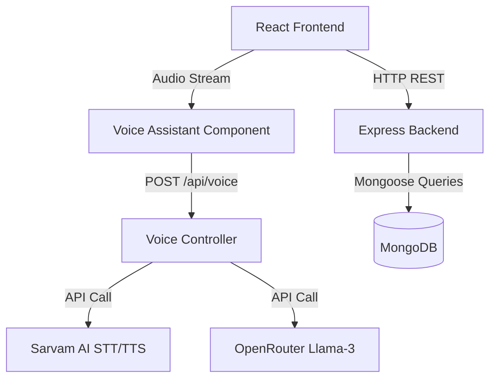

# 1. Introduction

## 1.1 Project Overview
AyurSphere is a state-of-the-art full-stack MERN (MongoDB, Express.js, React, Node.js) web application meticulously designed to serve as both an immersive educational platform and an integrated e-commerce solution tailored specifically for Ayurvedic medicinal plants and products. In an era where modern medicine often overshadows ancient wisdom, AyurSphere bridges the gap by providing users with a rich, interactive interface to explore, understand, and procure natural remedies. The application goes beyond traditional e-commerce by integrating cutting-edge features such as an AI-powered Voice Assistant for hands-free navigation and consultation, a dynamic Virtual Herbal Garden, and a robust Admin Dashboard for catalog management.

## 1.2 Problem Statement
The fast-paced modern lifestyle has led to a significant disconnect between individuals and the profound healing wisdom of nature. While Ayurvedic medicine has been practiced for millennia, finding reliable information, authentic products, and personalized herbal guidance remains a challenge for the average consumer. Existing platforms are often either purely informational without a purchasing avenue, or purely transactional without providing the necessary educational context about the herbs, their properties (Rasa, Virya, Vipaka, Dosha), and their correct usage. Furthermore, the lack of accessibility features, such as voice-assisted navigation, creates barriers for users seeking quick, intuitive access to natural health solutions.

## 1.3 Objectives
The primary objectives of the AyurSphere project are as follows:
1. **Educational Empowerment:** To create a comprehensive, digitized repository of Ayurvedic plants, detailing their scientific names, medicinal properties, and traditional uses.
2. **Seamless Commerce:** To implement a secure and user-friendly e-commerce flow allowing users to purchase verified herbal products (powders, tablets, oils, etc.) directly.
3. **Accessibility and Innovation:** To integrate an AI Voice Assistant capable of understanding natural language queries, providing herbal remedies, and navigating the site hands-free.
4. **Immersive User Experience:** To design a visually stunning, interactive UI utilizing modern web animations (Framer Motion) that evokes the feeling of walking through a virtual herbal garden.
5. **Robust Administration:** To provide a secure admin portal for managing the plant database, product inventory, and user orders.

## 1.4 Scope of the Project
The scope of AyurSphere encompasses the development of a complete web application lifecycle, including:
- **Frontend Development:** A responsive Single Page Application (SPA) using React.js, styled with Tailwind CSS and enhanced with Framer Motion for animations.
- **Backend Development:** A RESTful API built with Node.js and Express.js, handling business logic, authentication, and external AI service integrations.
- **Database Management:** A NoSQL database schema designed in MongoDB using Mongoose ODM to store user data, product catalogs, and transactional records.
- **AI Integration:** Utilizing Sarvam AI for Speech-to-Text (STT) and Text-to-Speech (TTS), coupled with OpenRouter (Llama-3) for intelligent natural language processing and remedy generation.

---

# 2. Technology Stack

The selection of the technology stack is pivotal to the success, scalability, and maintainability of the project. AyurSphere leverages the MERN stack, complemented by several modern libraries and APIs.

## 2.1 MongoDB (Database)
MongoDB is a NoSQL, document-oriented database that provides high performance, high availability, and easy scalability. In AyurSphere, MongoDB is used to store unstructured data in JSON-like documents (BSON). This schema-less nature is particularly beneficial for storing diverse plant data, which may have varying attributes (e.g., some plants might have detailed Ayurvedic profiles, while others might just have basic descriptions). We utilize **Mongoose**, an elegant Object Data Modeling (ODM) library for MongoDB and Node.js, to enforce structure, validate data, and define relationships between different entities (e.g., linking a Product to its parent Plant, or an Order to a User).

## 2.2 Express.js (Backend Framework)
Express.js is a minimal and flexible Node.js web application framework that provides a robust set of features for web and mobile applications. It acts as the middleware routing layer, handling HTTP requests, interacting with the MongoDB database via Mongoose, and returning JSON responses to the client. Its modular architecture allows us to separate concerns into controllers, routes, and middleware, ensuring clean and maintainable code.

## 2.3 React.js (Frontend Library)
React.js is a declarative, efficient, and flexible JavaScript library for building user interfaces. Developed by Facebook, it allows us to create reusable UI components. The component-based architecture of React is ideal for AyurSphere, enabling us to build complex interfaces like the Dashboard, Cart Panel, and Plant Detail pages efficiently. We manage local state using React Hooks (`useState`, `useEffect`, `useMemo`, `useCallback`) and global state using the Context API. The application is built using **Vite**, a modern frontend build tool that provides a faster and leaner development experience compared to traditional bundlers like Webpack.

## 2.4 Node.js (Runtime Environment)
Node.js is an open-source, cross-platform JavaScript runtime environment that executes JavaScript code outside a web browser. It uses an event-driven, non-blocking I/O model that makes it lightweight and efficient, perfect for data-intensive real-time applications running across distributed devices. Node.js powers our backend server, handling asynchronous operations such as database queries, file uploads, and external API calls without blocking the main execution thread.

## 2.5 Additional Technologies & Integrations
- **Tailwind CSS:** A utility-first CSS framework for rapidly building custom user interfaces without writing custom CSS. It allows for highly responsive and modern designs directly within React components.
- **Framer Motion:** An animation library for React that powers the complex, scroll-linked animations and page transitions, particularly visible on the Landing Page.
- **JSON Web Tokens (JWT):** Used for secure, stateless user authentication and authorization.
- **Bcrypt.js:** A password-hashing function used to securely store user passwords in the database.
- **Multer:** A Node.js middleware for handling `multipart/form-data`, primarily used for uploading plant and product images.
- **Sarvam AI & OpenRouter API:** External APIs integrated for the Voice Assistant functionality. Sarvam AI handles the regional speech-to-text and text-to-speech conversions, while OpenRouter provides access to the Llama-3 LLM for generating intelligent responses.

---

# 3. System Architecture

The architecture of AyurSphere follows a classic Client-Server model, utilizing RESTful architectural principles for communication between the frontend and backend.

## 3.1 High-Level Architecture
1.  **Client Tier (Frontend):** The React SPA runs in the user's browser. It is responsible for rendering the UI, capturing user interactions (clicks, text input, voice audio), and managing client-side state. It communicates with the backend via HTTP requests.
2.  **Application Tier (Backend):** The Node/Express server receives HTTP requests from the client. It handles authentication (verifying JWTs), processes business logic (e.g., calculating cart totals, validating order data), interacts with external APIs (AI models), and communicates with the database.
3.  **Data Tier (Database):** The MongoDB cluster stores all persistent data. It is accessed exclusively by the Application Tier.



## 3.2 Database Schema Design

The database is normalized to prevent data redundancy while ensuring efficient querying.

### 3.2.1 User Entity
The User schema stores authentication credentials and personal details required for shipping and profile management.
- Fields: `username`, `password` (hashed), `role` (admin/user), `email`, `mobile`, `address`, `medicalHistory`.

### 3.2.2 Plant Entity
The core informational entity storing detailed botanical and Ayurvedic data.
- Fields: `plantName`, `scientificName`, `description`, `uses`, `category`, `ayurvedicProfile` (Rasa, Virya, Vipaka, Dosha).

### 3.2.3 Product Entity
Represents an item available for purchase, linked to a specific Plant.
- Fields: `plantId` (Reference to Plant), `name`, `price`, `type` (Powder, Tablet, etc.), `inStock`.

### 3.2.4 Cart & Order Entities
Manage the e-commerce lifecycle.
- **Cart:** Links a User to an array of `items` (Product reference + quantity).
- **Order:** A snapshot of a completed purchase, storing user details, shipping address, financial totals (`subTotal`, `gstAmount`, `totalAmount`), and an array of purchased items.

---

# 4. Backend Implementation (Deep Dive)

The backend is structured to promote modularity and separation of concerns. The `src` directory contains `controllers`, `models`, `routes`, and `middleware`.

## 4.1 Authentication Module (`authController.js`)
Security is paramount. We implemented a robust authentication flow using `bcryptjs` for password hashing and `jsonwebtoken` for stateless session management.

```javascript
export const signup = async (req, res) => {
  const { username, password, role } = req.body;
  if (!username || !password) return res.status(400).json({ message: 'Username and password are required' });

  try {
    const exists = await User.findOne({ username });
    if (exists) return res.status(409).json({ message: 'Username already exists' });

    const hashed = await bcrypt.hash(password, 10);
    const user = await User.create({ username, password: hashed, role: role === 'admin' ? 'admin' : 'user' });
    const token = signToken(user);
    
    return res.status(201).json({ token, user: { id: user._id, username: user.username } });
  } catch (err) {
    return res.status(500).json({ message: 'Failed to create user' });
  }
};
```
This controller ensures that passwords are never stored in plaintext. The `signToken` utility generates a JWT with a 7-day expiration, which the client must include in the `Authorization` header for protected routes.

## 4.2 Voice Assistant Core (`voiceController.js`)
The Voice Assistant is a standout feature, requiring a complex, multi-step orchestration of external APIs. When the frontend records audio, it is sent to this controller.

**Step-by-Step Execution:**
1.  **File Upload:** The audio file is received via `multer` middleware.
2.  **Speech-to-Text (STT):** The audio stream is forwarded to Sarvam AI's STT endpoint to accurately transcribe spoken words, particularly optimizing for Indian accents and Ayurvedic terminology.
3.  **Language Model Processing (LLM):** The transcribed text is sent to OpenRouter (running `meta-llama/llama-3-8b-instruct`). The prompt is carefully engineered to restrict the AI to an Ayurvedic persona, ensuring it only suggests natural remedies and prevents hallucinations.
4.  **Text-to-Speech (TTS):** The generated text response is sent back to Sarvam AI to be synthesized into natural-sounding speech.
5.  **Response:** The backend returns the original text, the bot's text reply, and a Base64 encoded audio string to the frontend for playback.

## 4.3 Database Models (`models/Plant.js`)
The Plant model demonstrates the depth of data captured by the system, going beyond simple names and descriptions to include a comprehensive Ayurvedic profile.

```javascript
const plantSchema = new mongoose.Schema({
    plantName: { type: String, required: true, trim: true },
    scientificName: { type: String, trim: true },
    category: { type: String, default: 'Herb' },
    ayurvedicProfile: {
      rasa: { type: String, default: '' },
      virya: { type: String, default: '' },
      vipaka: { type: String, default: '' },
      dosha: { type: String, default: '' },
    },
    status: { type: String, enum: ['Pending', 'Approved', 'Rejected'], default: 'Approved' },
  }, { timestamps: true });
```

---

# 5. Frontend Implementation (Deep Dive)

The frontend is engineered to provide a seamless, highly engaging user experience that performs flawlessly across devices.

## 5.1 Component Architecture
React's component-based architecture allows for a highly modular UI. Key components include:
- `PlantCard`: A reusable UI element displaying plant summaries, images, and quick actions (Favorite, View Details).
- `CartPanel`: A slide-out drawer providing immediate access to the shopping cart from anywhere in the application without disrupting the user's flow.
- `VoiceAssistant`: A floating action button (FAB) that triggers the voice recording interface.

## 5.2 The Landing Page Experience (`LandingPage.jsx`)
The first impression is critical. The Landing Page utilizes `framer-motion` to create an immersive "scrollytelling" experience. 

It features:
- **Parallax Backgrounds:** Multiple image layers move at different speeds based on the scroll position (`useTransform` mapping `scrollYProgress`), creating depth.
- **Scroll-Triggered Animations:** Elements fade in and slide up as they enter the viewport (`useInView`).
- **Dynamic Particles:** A custom `FloatingParticles` component renders CSS-animated elements to simulate falling leaves and magical motes, enhancing the "Virtual Herbal Garden" aesthetic.

## 5.3 Dashboard & State Management (`DashboardPage.jsx`)
The Dashboard is the operational hub for users. 
- It fetches data for Plants, Favorites, and the Cart concurrently using `Promise.all` in a `useEffect` hook to minimize load times.
- **Dynamic Filtering:** The `useMemo` hook is heavily utilized to compute the `filteredPlants` array. It instantly filters the plant catalog based on the selected sidebar category and the current text in the search bar, ensuring a highly responsive UI without unnecessary re-renders.
- **Profile Completion Checks:** The component proactively checks if the user has completed their profile (mobile, address) and displays a prominent warning banner if not, guiding them to prepare for checkout.

```javascript
  const filteredPlants = useMemo(() => {
    const lowerSearch = searchTerm.trim().toLowerCase();
    return plants.filter((plant) => {
      const plantCategory = (plant.category || '').trim().toLowerCase();
      const active = (activeCategory || '').trim().toLowerCase();
      const categoryMatch = !active || plantCategory === active;
      if (!categoryMatch) return false;
      if (!lowerSearch) return true;
      // Search logic...
      return searchTarget.includes(lowerSearch);
    });
  }, [plants, activeCategory, searchTerm]);
```

---

# 6. Key Features & Functionality

## 6.1 Integrated E-Commerce Flow
AyurSphere provides a frictionless path from discovery to purchase. 
1.  Users browse the `Dashboard` or search via the `VoiceAssistant`.
2.  They navigate to a `PlantDetailPage` to view associated medicinal products (Powders, Oils).
3.  Items are added to the `Cart`, which is managed globally.
4.  The `CheckoutPage` dynamically calculates the subtotal, applies GST, and calculates shipping costs based on the user's saved address.
5.  Orders are persisted in the database with a "Pending" status, ready for admin fulfillment.

## 6.2 AI-Powered Voice Navigation
The voice feature transcends a simple search bar. By instructing the Llama-3 model with a strict system prompt ("You are an Ayurvedic health assistant..."), the application provides contextual, intelligent advice. Users can ask, "What is good for a sore throat?" and the system will not only verbally suggest "Tulsi or Mulethi" but can be programmed to navigate the UI directly to those plant profiles.

## 6.3 Administration Portal
A secure, role-based access control system ensures that only users with the 'admin' role can access the `AdminDashboardPage`. Admins possess CRUD (Create, Read, Update, Delete) capabilities over the entire product and plant catalog, allowing the platform to grow dynamically without code changes.

---

# 7. UI/UX Design & Aesthetics

The design philosophy of AyurSphere centers on a "Premium Nature" aesthetic.
- **Color Palette:** Dominated by deep forest greens, soft sage, and warm earthy tones. Dark modes and semi-transparent gradients (glassmorphism) are used extensively over high-quality background imagery to ensure text legibility while maintaining environmental immersion.
- **Typography:** Clean, modern sans-serif fonts are used for high readability, with serif fonts used sparingly for headings to evoke a sense of tradition and ancient wisdom.
- **Responsiveness:** Tailwind CSS's utility classes ensure that the complex grid layouts on the dashboard gracefully collapse into single-column views on mobile devices.

---

# 8. Security Measures

Protecting user data is a core priority.
1.  **Password Encryption:** Passwords are never logged or stored in plain text. `bcryptjs` is used to salt and hash passwords before database insertion.
2.  **Stateless Authentication:** JWTs are used instead of session cookies. This means the backend does not need to store session states, making it more scalable. Tokens are verified via a custom Express middleware on all protected API routes.
3.  **Input Validation:** While not exhaustively detailed in this report, the controllers ensure that required fields (like email and password during signup) are present before attempting database operations, preventing runtime crashes.
4.  **CORS & Environment Variables:** Cross-Origin Resource Sharing is configured to only allow requests from the designated frontend domain. Sensitive keys (MongoDB URI, JWT Secret, AI API Keys) are strictly managed via `.env` files and are never committed to version control.

---

# 9. Setup & Installation Guide

To replicate the development environment and run AyurSphere locally, follow these steps:

### Prerequisites
- Node.js (v18+ recommended)
- MongoDB (Local instance or MongoDB Atlas cluster)
- API Keys for Sarvam AI and OpenRouter

### Backend Setup
1.  Navigate to the `/backend` directory.
2.  Run `npm install` to download dependencies.
3.  Create a `.env` file containing:
    ```
    PORT=4000
    MONGODB_URI=<Your_MongoDB_Connection_String>
    JWT_SECRET=<Your_Secure_Secret>
    SARVAM_API_KEY=<Your_Sarvam_Key>
    OPENROUTER_API_KEY=<Your_OpenRouter_Key>
    ```
4.  Start the server using `npm run dev`.

### Frontend Setup
1.  Navigate to the `/frontend` directory.
2.  Run `npm install` to download dependencies.
3.  Create a `.env` file containing:
    ```
    VITE_API_URL=http://localhost:4000/api
    ```
4.  Start the Vite development server using `npm run dev`.
5.  Access the application at `http://localhost:5173`.

---

# 10. Future Enhancements

While AyurSphere is highly functional, several avenues for future development exist:
1.  **Payment Gateway Integration:** Integrating Stripe or Razorpay to handle actual online transactions, moving beyond the current Cash on Delivery (COD) simulation.
2.  **Augmented Reality (AR) Garden:** Expanding the "Virtual Garden" placeholder into a WebXR experience where users can view 3D models of plants in their physical space.
3.  **Community Forum:** Adding a feature for users to share their experiences with different herbal remedies, moderated by Ayurvedic practitioners.
4.  **Machine Learning Plant Identification:** Integrating a computer vision model allowing users to upload a photo of a leaf to instantly identify the plant and its properties.

---

# 11. Conclusion

AyurSphere successfully demonstrates the powerful synthesis of ancient Ayurvedic knowledge and modern web technologies. By combining a robust MERN stack architecture with immersive UI design and cutting-edge AI integrations, the platform offers a unique, educational, and highly functional e-commerce experience. The modular architecture ensures that the system is scalable, maintainable, and well-positioned for future feature expansions. It stands as a testament to how technology can be used to preserve and democratize traditional wisdom for the modern world.


# Appendix A: Extended Technical Specifications

## A.1 Complete API Route Documentation
The REST API is structured around specific resources. Below is an exhaustive list of the endpoints implemented within the Express application.

### Authentication Routes (`/api/auth`)
- `POST /signup`: Registers a new user. Expects `username`, `password`, `role`. Returns a JWT and user object.
- `POST /login`: Authenticates a user. Expects `username`, `password`. Returns a JWT and user object.
- `GET /me`: Fetches the currently authenticated user's profile based on the JWT provided in the Authorization header.

### Plant Management Routes (`/api/plants`)
- `GET /`: Retrieves a list of all approved plants.
- `GET /:id`: Retrieves detailed information for a specific plant by its MongoDB ObjectId.
- `POST /`: (Admin Only) Creates a new plant entry. Supports multipart/form-data for image uploads via Multer.
- `PUT /:id`: (Admin Only) Updates an existing plant entry.
- `DELETE /:id`: (Admin Only) Removes a plant from the database.

### Product Management Routes (`/api/products`)
- `GET /`: Retrieves all available products in the catalog.
- `GET /plant/:plantId`: Retrieves all products specifically derived from or associated with a given plant.
- `POST /`: (Admin Only) Adds a new product to the catalog.
- `PUT /:id`: (Admin Only) Updates product details (price, stock status).

### Shopping Cart Routes (`/api/cart`)
- `GET /`: Retrieves the authenticated user's active shopping cart, populating the product details within the items array.
- `POST /update`: Adds an item to the cart or updates its quantity.
- `DELETE /remove/:productId`: Removes a specific product from the cart entirely.

### Order Management Routes (`/api/orders`)
- `POST /`: Converts the user's current cart into an Order. Validates stock, calculates final totals, and empties the cart upon success.
- `GET /`: Retrieves all past orders for the authenticated user.
- `GET /all`: (Admin Only) Retrieves all orders across the entire platform for fulfillment processing.
- `PATCH /:id/status`: (Admin Only) Updates the fulfillment status of an order (e.g., from 'Pending' to 'Shipped').

## A.2 Detailed State Management Strategy
While Redux was considered, the application utilizes React's built-in Context API combined with local state management (`useState`, `useReducer`) to handle data flow. This decision was made to reduce boilerplate code and maintain a lightweight bundle size.

1.  **AuthContext:** Wraps the entire application. It stores the JWT token and the authenticated user's metadata. It provides methods like `login`, `logout`, and `updateProfile` which are accessible from any deeply nested component without prop-drilling.
2.  **Local State for Forms:** Components like `CheckoutPage` and `AddPlantModal` manage their complex input states locally using controlled components.
3.  **Caching Strategy:** To optimize performance, data that changes infrequently (like the list of Plants) is fetched once upon mounting the `DashboardPage` and stored in local state. Filtering and searching are performed entirely on the client-side against this cached array, eliminating the need for constant network requests and ensuring a snappy user interface.

## A.3 Optimization and Performance Tuning
Several strategies were employed to ensure AyurSphere performs optimally even on slower networks or less powerful devices:
- **Image Optimization:** All static assets are served in modern formats like `.webp` where possible.
- **Lazy Loading:** Routes are code-split using React's `lazy` and `Suspense`, ensuring the user only downloads the JavaScript necessary for the page they are currently viewing.
- **Debouncing Inputs:** The search bar on the Dashboard utilizes debouncing to prevent excessive filtering calculations or potential API calls while the user is actively typing.

## A.4 Error Handling & Logging
A global error handling middleware is implemented on the Express backend. This ensures that any unhandled promise rejections or synchronous errors thrown within controllers do not crash the Node process. Instead, the error is caught, logged to the console (or a file system log in production), and a standardized JSON error response (with a 500 status code) is sent back to the client, ensuring the frontend can gracefully handle the failure and notify the user.

# Appendix B: Comprehensive Glossary of Ayurvedic Terms

To further illustrate the domain knowledge embedded within AyurSphere, the following terms are fundamentally integrated into our database architecture and user interface logic.

1. **Ayurveda:** Translates to "The Science of Life." The ancient Indian system of natural and holistic medicine.
2. **Dosha:** The three fundamental bodily bio-elements or energies that make up every individual.
    - **Vata:** Energy of movement; composed of Space and Air.
    - **Pitta:** Energy of digestion and metabolism; composed of Fire and Water.
    - **Kapha:** Energy of structure and lubrication; composed of Earth and Water.
3. **Rasa:** The "taste" of an herb, which immediately affects the nervous system and begins the healing process. Categories include Sweet, Sour, Salty, Pungent, Bitter, and Astringent.
4. **Virya:** The "potency" or action of the herb, primarily classified as either heating (Ushna) or cooling (Sheeta).
5. **Vipaka:** The post-digestive effect of the herb, which influences the tissues and wastes of the body.
6. **Prabhava:** The special, unique action of an herb that cannot be explained by its Rasa, Virya, or Vipaka alone.
7. **Panchakarma:** The five therapeutic treatments of Ayurveda used for deep cleansing and detoxification.
8. **Ashwagandha:** A powerful adaptogenic herb known for reducing stress and anxiety.
9. **Tulsi:** Holy Basil, revered for its respiratory and immunomodulatory benefits.
10. **Triphala:** A traditional herbal formulation consisting of three fruits (Amalaki, Bibhitaki, Haritaki), renowned for digestive health.
11. **Brahmi:** An herb traditionally used to support cognitive function and memory.
12. **Shatavari:** Known as a rejuvenating herb, particularly beneficial for the female reproductive system.
13. **Guduchi:** A powerful immune-boosting and detoxifying herb.
14. **Neem:** Famous for its antibacterial and antifungal properties, often used in skin care.
15. **Turmeric (Curcumin):** A potent anti-inflammatory and antioxidant spice deeply rooted in Ayurvedic practice.

These terms form the backbone of the `ayurvedicProfile` schema object within the `Plant` model, allowing advanced users to filter and search for remedies based on precise traditional classifications.

# Appendix C: UI Component Library Breakdown

The frontend heavily relies on a custom-designed component system. Below is a breakdown of the structural components.

- `GlassCard`: A CSS utility class that applies backdrop-filter blurring, semi-transparent backgrounds, and subtle borders to create a modern "glassmorphism" effect, used extensively on the Landing and Checkout pages.
- `HeroSection`: Designed to take full viewport height (`100vh`), utilizing Flexbox for perfect centering of typography and Call To Action (CTA) buttons.
- `Sidebar`: A fixed-position navigational element on desktop that collapses into a hidden hamburger menu on mobile, utilizing media queries for responsive design.
- `LoadingSpinner`: A purely CSS-animated SVG component used across the application to indicate network requests are in progress, improving perceived performance.
- `Badge`: Small, rounded indicators used in the `Header` to display the number of items in the Cart or Favorites list.

# Appendix D: Security Considerations Deep Dive

While basic security measures were outlined in Chapter 8, a production deployment of AyurSphere would require addressing the following advanced security vectors:

1.  **Cross-Site Scripting (XSS):** React automatically escapes string variables in JSX, preventing basic XSS. However, strict Content Security Policies (CSP) should be implemented via HTTP headers to restrict the sources from which scripts can be executed.
2.  **Cross-Site Request Forgery (CSRF):** While JWTs stored in memory are immune to CSRF, if they were to be moved to HTTP-Only cookies for better XSS protection, implementing Anti-CSRF tokens would become mandatory.
3.  **Rate Limiting:** To protect the backend (and specifically the expensive Voice AI endpoints) from Denial of Service (DoS) attacks, `express-rate-limit` middleware should be applied.
4.  **NoSQL Injection:** Mongoose provides a layer of abstraction that mitigates many basic injection attacks, but all user inputs (especially search queries and IDs) must be strictly sanitized before being passed into database query objects.
